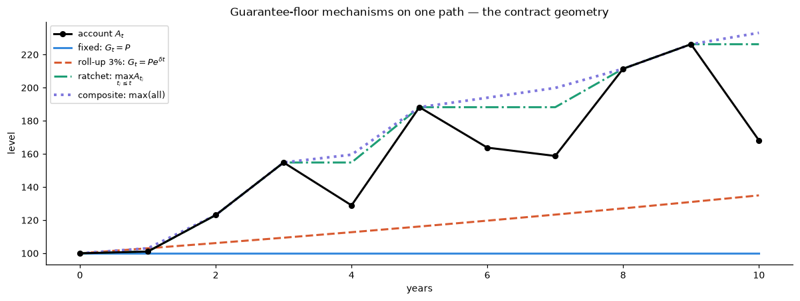
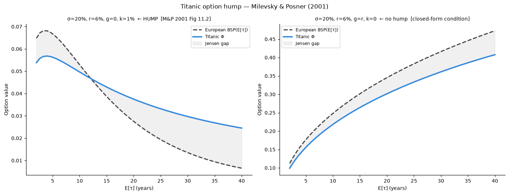
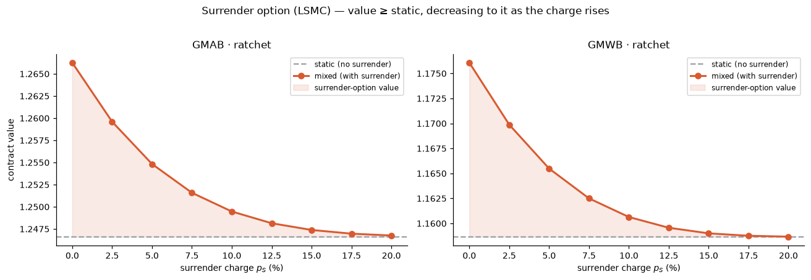
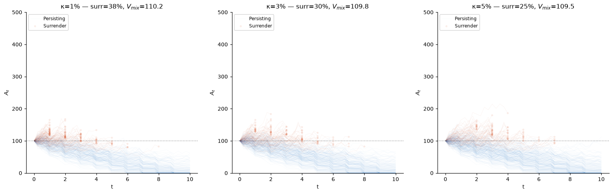
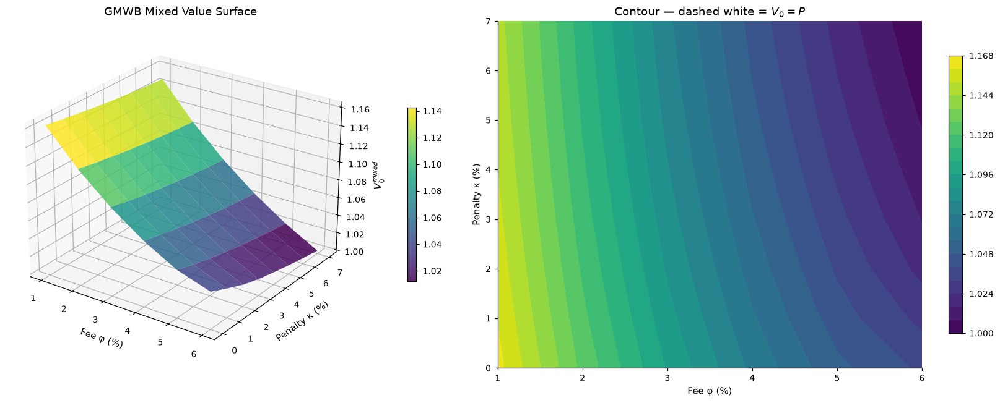
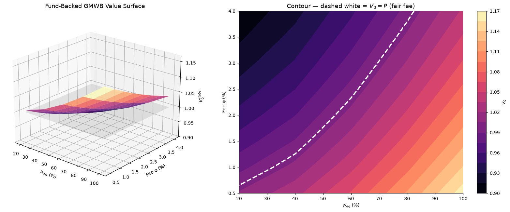

# A Unifying Valuation Framework for Variable Annuities

### GMDB · GMAB · GMWB — three composable guarantee floors, two valuation schemes

---

Variable annuities are usually modelled one rider at a time: a separate object for the
death benefit, another for the withdrawal benefit, a runtime flag for surrender. That
design hides the fact that every guarantee in the family is the *same* object — a floor
that ratchets, rolls up, or stays fixed, evaluated against the account at the contract's
event dates. This note collapses the family onto one contract class with **three
composable floors** (living, death, surrender) and **two valuation schemes** (static and
static-plus-surrender), all driven by the same stochastic factors.

The framework synthesises Bacinello et al. (2011) and Fontana & Rotondi (2023) under one
deliberate principle: **contractual death and terminal benefits are never penalised; the
only behavioural event that incurs a charge is surrender.**

> **Scope.** Three guarantee types — GMDB, GMAB, GMWB. Static (S) and
> static-plus-surrender (S+S, "mixed") schemes. Withdrawals are always contractual (the
> guaranteed amount $g$); dynamic withdrawal optimisation is out of scope. Surrender is
> priced by a single flat charge $p_S$ — there is no separate excess-withdrawal penalty.

---

## 1 · The market model in one paragraph

A single premium $P$ is paid at time $0$; anniversaries are $\mathcal{T}=\{1,\dots,N\}$
with $N=T$ the maturity. The reference fund is $(S_t)$, the account value $(A_t)$ with
$A_0=P$, the short rate $(r_t)$ with numéraire $M_t=\exp(\int_0^t r_u\,du)$, and the
residual lifetime $\tau_D$. A proportional fee $\alpha$ is deducted **continuously** from
the account; $g=P/N$ is the guaranteed withdrawal. Everything below is an expectation
under a fixed pricing measure $\mathbb{Q}$, with financial and mortality risk independent
so survival enters either through deterministic weights $\pi_n$ or a simulated $\tau_D$.

The account follows Bacinello's eq. (4.3),

$$
dA_t=A_t\,\frac{dS_t}{S_t}-\alpha A_t\,dt-dB^{L}_t,\qquad A_0=P,
$$

with $B^{L}_t$ the cumulated **living benefits**. The fee $\alpha$ is deducted **continuously and
proportionally** and is borne by the **account only**. Living benefits are deducted **discretely** and
reduce **the account and every guarantee floor alike**.

---

## 2 · Guarantee floors as composable mechanisms

This is the structural core. A floor is a `max` over a list of elementary **schemes**,
each of which knows only how to advance itself one anniversary:

| Scheme | Update $G_{(n-1)^+}\to G_{n^-}$ |
|--------|---------------------------------|
| **Fixed** | $G_{(n-1)^+}$ (optionally $\times(1-\varepsilon)$) |
| **RollUp** | $G_{(n-1)^+}\,e^{\delta\Delta t}$ |
| **Ratchet** | $\max(G_{(n-1)^+},A_{n^-})$ on the scheme's dates, else unchanged |
| **Reset** | $A_{n^-}$ on reset dates (may decrease) |

A floor is `max` over a list of schemes; all start at $G_0=P$.

- **Living floor $G^X$** — terminal payoffs, and the base reduced by living benefits in the GMWB.
- **Death floor $G^D$** — the death cashflow.
- **Surrender floor $G^S$** — the surrender cashflow.

Putting §2 and §3 together, each floor advances by its own schemes and is then reduced by the common
living benefit:

$$
G^{\bullet}_{n^-}=\max_{\text{schemes}}\{\text{scheme.update}(G^{\bullet}_{(n-1)^+},A_{n^-})\},
\qquad
G^{\bullet}_{n^+}=G^{\bullet}_{n^-}-\Delta B^{L}_n .
$$

A separable **GMDB** (only meaningful on a GMAB) is *not* a separate cashflow object — it is simply an
independent death floor $G^D\neq G^X$, e.g. `Floor([RollUp, Ratchet])` (Bacinello's eq. (3.7)). 

In code this is a handful of small classes — the whole contract geometry of the GMxB family lives here:

```python
class GuaranteeScheme(ABC):
    @abstractmethod
    def update(self, G_prev, A_now, t, dt): ...

class Fixed(GuaranteeScheme):    # G_prev * multiplier
    def __init__(self, multiplier=1.0): ...

class RollUp(GuaranteeScheme):   # G_prev * exp(delta * dt)
    def __init__(self, delta): ...

class Ratchet(GuaranteeScheme):  # max(G_prev, A_now) on its dates; step-up = Ratchet(all)
    def __init__(self, dates=None): ...

class Reset(GuaranteeScheme):    # A_now on reset dates (may decrease)
    def __init__(self, dates): ...

class GuaranteeFloor:
    def __init__(self, schemes, G0=1.0):
        self.schemes, self.G0 = schemes, G0
    
    def step(self, G_prev, A_now, t, dt):          # element-wise max over schemes
        return reduce(torch.maximum,
                      (s.update(G_prev, A_now, t, dt) for s in self.schemes))
```

The figure below materialises each mechanism on one fund path. The composite floor is the
upper envelope of all of them; this is the "contract geometry" that the hedger in Parts 2
and 3 has to track.



*Each floor starts at the premium $P$ and advances by its own rule. **Fixed** is flat; **roll-up** grows deterministically at $\delta$; **ratchet** locks in new account highs and never falls; the **composite** is the maximum of all three. The account $A_t$ (black) is the thing being floored.*

---

## 3. Products and their cashflow methods

```python
class GMxBAnnuity(BaseDerivative, ABC):
    @abstractmethod
    def living_cashflow(self, t, A, G_X): ...
    
    @abstractmethod
    def terminal_cashflow(self, A_plus, G_X_plus): ...

    def death_cashflow(self, t, A, G_D):        
        return torch.maximum(A, G_D)
    
    def surrender_cashflow(self, t, A, G_S):    
        return (1.0 - self.p_S) * torch.maximum(A, G_S)

class GMABAnnuity(GMxBAnnuity):
    def living_cashflow(self, t, A, G_X):   
        return torch.zeros_like(A)
    
    def terminal_cashflow(self, A1, G1):    
        return torch.maximum(A1, G1)

class GMWBAnnuity(GMxBAnnuity):
    def living_cashflow(self, t, A, G_X):
        return torch.full_like(A, self.g) if t in self.schedule else torch.zeros_like(A)
    
    def terminal_cashflow(self, A1, G1):    
        return torch.maximum(A1, G1)
```

### 3.1 GMAB
- **living** $=0$ throughout; at $T$ the terminal cashflow is paid.
- **terminal** $=\max(A_T,\,G^X_T)$.
- **death** $=\max(A_{n^-},\,G^D_{n^-})$. Default $G^D=$ `Fixed(0)` $\Rightarrow\max(A_{n^-},0)$ (return of account); attach an independent $G^D$ for a separable GMDB.
- **surrender** — §5

### 3.2 GMWB
- **living** $=g$ at each anniversary $n=1,\dots,N$.
- **terminal** (date $N$): the **last withdrawal $g$ is paid in addition** to the residual guarantee:

$$
\text{cashflow}_N \;=\; g \;+\; \max\big(A_{N^+},\,G^X_{N^+}\big),
\qquad A_{N^+}=(A_{N^-}-g)^+,\ \ G^X_{N^+}=G^X_{N^-}-g .
$$
- **death** $=\max(A_{n^-},\,G^D_{n^-})$. With $G^D=$ `Fixed(P)`, the §2 reduction gives $G^D_{n^-}=P-(n-1)g=$ the **nominal sum of remaining guaranteed withdrawals** — an undiscounted analogue of Bacinello's $R_t$.
- **surrender** — §5 (Bacinello withdrawal-date specialisation included).

---


## 4 · The death benefit is a Titanic option

Before adding surrender, it is worth isolating the death benefit, because it has a clean
analytic identity. A guaranteed-minimum *death* benefit pays at the (random) death time
$\tau_D$, so its value integrates the put payoff against the mortality density,

$$
\Phi=\int_0^T f(t)\,\mathrm{BSP}(t)\,dt ,
$$

a **Titanic option** in the sense of Milevsky & Posner (2001). Sweeping the expected
lifetime $\mathbb{E}[\tau_D]$ produces their characteristic hump: the value first rises
(more time for the embedded put to finish in the money) then falls (very long lives let
the fund recover, and the fee erodes the account). The European put evaluated at
$\mathbb{E}[\tau_D]$ — a Jensen upper bound by convexity in $\tau$ — keeps rising, so the
gap between the two curves is exactly the convexity of the put in the time-to-death.



*The Titanic (death-benefit) value humps in $\mathbb{E}[\tau_D]$ while the European put at
the mean lifetime is monotone — the gap is the Jensen convexity term, i.e. $= 1 - E_\lambda\!\left[e^{-l\tau}\right] \;<\; 1 - e^{-l\,E_\lambda[\tau]}$, therefore assuming that both options are subject to the same drift (i.e. fees are deducted), then the Jensen's gap is dictated by the shape of the curve describing fees as function of the time-to-death, as long as that is convex, evaluating with the mean time-to-death the expected value of fees paid will be always higher, perhaps the key component of the cross in valuation is dictated by $\partial^2 \phi / \partial \tau^2 \le 0$. Reproduces Milevsky
& Posner (2001), Fig. 11.2.*

---

## 5 · The surrender option and the mixed valuation

Adding surrender turns the contract into an optimal-stopping problem. With surrender time
$\tau_S$, the time-0 value net of fees is

$$
V_0=\sup_{\tau_S}\,\mathbb{E}\!\left[\sum_{n=1}^{N\wedge\tau_S}
\Big(\mathbb{1}_{\{\tau_D>n\}}\,\text{living}_n+\mathbb{1}_{\{n-1<\tau_D\le n\}}\,\text{death}_n\Big)\frac{M_0}{M_n}
+\mathbb{1}_{\{\tau_D>\tau_S\}}\,\text{surrender}_{\tau_S}\frac{M_0}{M_{\tau_S}}\right].
$$

- **Static (S):** $\tau_S\equiv\infty$, the supremum vanishes — ordinary Monte Carlo.
- **Mixed (S+S):** $\tau_S\in\{1,\dots,N-1\}$ — Least-Squares Monte Carlo (Longstaff–Schwartz)
  on the basis $(A/P,\,r,\,K,\,\mu,\,G^S/P)$ up to degree 4. Because withdrawals are
  contractual, the guarantee paths are precomputed in a forward pass and the only decision
  is a binary stop — exactly where LSMC is reliable.

By construction $V_0^{S}\le V_0^{S+S}$: the surrender option can only add value. Pricing a
ratchet GMAB and GMWB across a grid of surrender charges $p_S$ shows the surrender-option
value (the shaded gap) shrinking monotonically toward the static value as the charge bites
— the textbook structural result, reproduced here without any closed form.



*The mixed value sits above the static value; the shaded area is the surrender option. As
the charge $p_S$ rises, early exit is penalised and the option decays back to the static
contract.*

The **surrender geography** makes the LSMC exercise boundary visible: paths that the
regression flags for surrender (orange) cluster above the at-the-money line and near the
early anniversaries, while persisting paths (blue) are the ones whose account has drifted
below the floor — exactly the population for whom the guarantee is worth keeping.



*Account paths coloured by the LSMC stopping rule, for rising surrender charge $\kappa$.
Higher charges thin out the surrendering cohort and lift the realised lapse-adjusted value
toward the static floor.*

---

## 6 · Fair fees and the fee–penalty surface

The contract is **fairly priced** when $V_0(\alpha)=P$; the fair fee $\alpha^*$ solves
this. Because $V_0^S\le V_0^{S+S}$, the fair fee for the surrenderable contract is always
the higher one: $\alpha^{*,S}\le\alpha^{*,S+S}$. Mapping the mixed value over the
fee–penalty plane $(\varphi,\kappa)$ gives a clean monotone surface whose $V_0=P$ contour
is the locus of fair contracts — the desk's pricing menu.



*GMWB mixed value over the fee $\varphi$ and surrender charge $\kappa$. The value falls in
the fee (more is skimmed from the account) and rises as the charge falls (surrender is
worth more). The $V_0=P$ contour is the fair-fee curve.*


## 7. Fairs fees and the fee-equity surface

The GMxB(Fund=Bonds,Equities)




---

### References
- Bacinello, Millossovich, Olivieri & Pitacco (2011), *Variable annuities: A unifying valuation approach*, **Insurance: Mathematics and Economics**.
- Fontana & Rotondi (2023), *Valuation of variable annuities with guaranteed minimum benefits and surrender options*.
- Milevsky & Posner (2001), *The Titanic option: valuation of the guaranteed minimum death benefit*.

