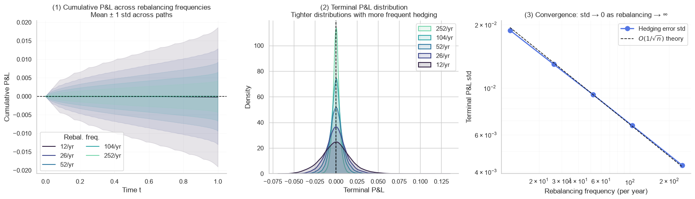
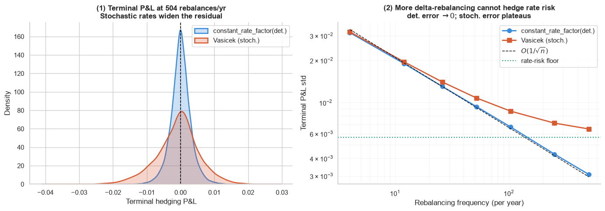
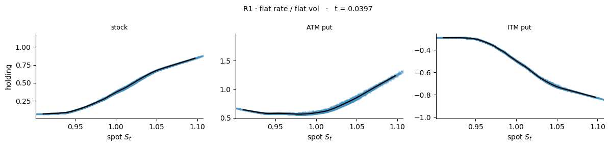
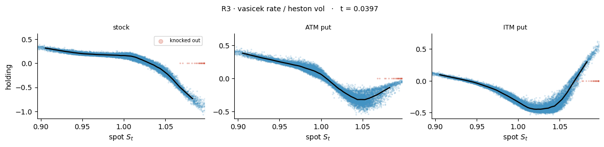
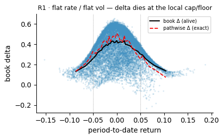
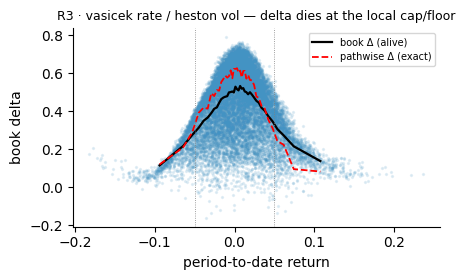
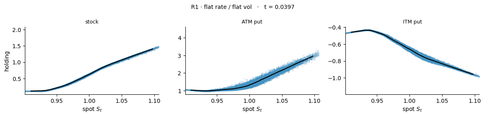
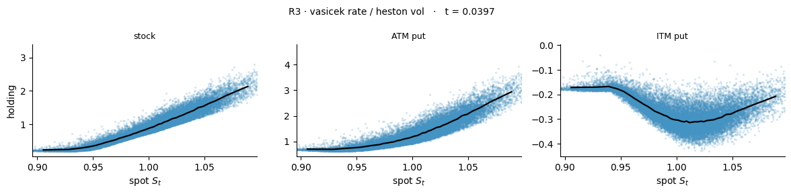

# Deep Hedging Across Regimes

### One neural policy, vanilla to exotic, three worlds — and why it is a PINN in disguise

---

## 1 · Mark-to-market hedging — the error has a known rate

For a delta-hedged short call, the one-step replication error over $\Delta t$ is dominated by gamma:

$$
\mathrm{PnL}_{t_i\to t_{i+1}} \approx \tfrac12\,\Gamma_i S_i^2\,\sigma^2\Delta t\,(\varepsilon^2-1),
\qquad \varepsilon\sim\mathcal N(0,1).
$$

Because $\mathbb E[\varepsilon^2-1]=0$ the error is mean-zero, and its variance scales like $(\Delta t)^2$ per step. 

$$
\mathrm{\textit{d}PnL} \;\approx\; \frac12 \Gamma_i S_i^2 \Bigl[\bigl(\tfrac{\Delta S}{S}\bigr)^2 - \sigma^2\Delta t\Bigr] \;\approx\; \frac12 \Gamma_i S_i^2 \,\sigma^2\Delta t\,(\varepsilon^2-1).
$$

From (1) and $\mathbb{E}[\varepsilon^2]=1$, $\text{Var}(\varepsilon^2)=2$:

$$
\mathbb{E}[d\mathrm{PnL}] \approx \frac12 \Gamma_i S_i^2 \,\sigma^2\Delta t\,\mathbb{E}[\varepsilon^2-1] = 0 .
$$

Hence $\text{Var}(d\mathrm{PnL}) = \mathbb{E}[d\mathrm{PnL}^2] - (\mathbb{E}[d\mathrm{PnL}])^2 = \mathbb{E}[d\mathrm{PnL}^2]$.

$$
\begin{aligned}
\text{Var}(d\mathrm{PnL})
&\approx \Bigl(\frac12 \Gamma_i S_i^2 \sigma^2\Delta t\Bigr)^2 \mathbb{E}[(\varepsilon^2-1)^2] = \Bigl(\frac12 \Gamma_i S_i^2 \sigma^2\Delta t\Bigr)^2 \cdot 2
\;\propto\; (\Delta t)^2 .
\end{aligned}
$$

Summing $n$ independent steps over a fixed horizon $T=n\Delta t$,

$$
\text{Var}(\text{PnL})
\approx \sum_{i=0}^{n-1} \text{Var}(d\mathrm{PnL}_i)
\propto n \cdot (\Delta t)^2
= n\cdot\frac{T^2}{n^2} = \frac{T^2}{n}.
$$

Since $T$ is **fixed**, the only variable part is $1/n$. Thus

$$
\text{Var}(\text{PnL}) = O\Bigl(\frac{1}{n}\Bigr),
\qquad
\text{Std}(\text{PnL}) = O\Bigl(\frac{1}{\sqrt{n}}\Bigr).
$$


Simulating the hedge at five rebalancing frequencies confirms the rate exactly: the
terminal P&L distribution tightens as $1/\sqrt n$, and the log-log convergence panel lands
on the theoretical slope.



*Left: cumulative P&L fans out then tightens with frequency. Centre: terminal P&L distributions sharpen as rebalancing increases. Right: terminal-P&L std vs frequency on log-log axes, tracking the $O(1/\sqrt n)$ reference line.*

### What a flat-rate delta misses

Real desks quote a flat-rate Black–Scholes delta, but the financing account accrues at the
*realised* short rate. Swapping **only** the rate factor — `ConstantRateFactor` →
`VasicekRateFactor`, correlated with equity — isolates that mismatch. The deterministic
world's error still vanishes as $O(1/\sqrt n)$; the stochastic world's error **plateaus**:
no amount of delta-rebalancing can hedge a risk the delta does not see.

```python
def build_world(correlation, seed=42, n_paths=30_000, **kw):
    # One SDESystem, two named factors. ConstantRateFactor carries no Brownian
    # driver, so swapping it for VasicekRateFactor is the ONLY change between
    # the two worlds — same equity factor, same seed, same calendar.
    sysm = SDESystem(
        {
            "euribor_1m": VasicekRateFactor(kappa=kappa, theta=theta, sigma=sigma, r0=r0),
            "sx5e": GeometricBrownianFactor(sigma=sigma, s0=S0, rate="euribor_1m"),
        },
        correlation=correlation,
    )
    cal = EventCalendar.from_horizon(T, dt=T / N_FINE)
    sysm.simulate(cal, n_paths, seed=seed)
    return sysm, cal.as_tensor(dtype=torch.float32)
```



*Stochastic rates widen the terminal P&L (left) and, crucially, impose a **floor** on the
hedging error that more frequent delta-rebalancing cannot cross (right). The residual
$\sqrt{\sigma_{\text{stoch}}^2-\sigma_{\text{det}}^2}$ is the unhedged rate risk — roughly
frequency-invariant.*

---

## 2 · The deep hedger — and why it is a PINN

A deep hedge replaces the analytic delta with a small MLP that reads a feature vector and
outputs a holding in each instrument of a hedge ladder. It is trained directly on simulated
paths by minimising a risk functional of the terminal hedged P&L. Three design choices make
this a **physics-informed** network rather than a generic function approximator:

1. **The loss is the objective, not a label.** There are no target holdings to regress
   against. The network minimises a variance (or CVaR) loss over the realised P&L of the
   *whole* hedging strategy — the financial objective is the training signal. This is the
   deep-hedging analogue of a PINN minimising a PDE residual instead of fitting labelled
   points.

2. **The structure is baked into the policy, not learned from scratch.** Hard, measurable
   constraints enter as a `base_policy` (a structural prior the network only has to
   *correct*) and a `liveness` gate (a $\{0,1\}$ mask that zeros the book on paths whose
   liability has died — knocked-out barrier, exhausted cliquet, settled death benefit). The
   network learns the *residual* on top of known financial structure, exactly as a PINN
   hard-codes boundary conditions and learns the interior.

3. **The state features are the physics.** Moneyness, time-to-maturity, instantaneous vol,
   short rate, hazard and survival are the coordinates the no-arbitrage price actually
   depends on. Feeding them — and nothing else — is what lets one architecture generalise
   across regimes.

The training loop is small and explicit:

```python
hed = DeepHedger(
    HedgingMLP(feats.total_dim, n_hedges=len(legs), seed=seed),
    feats,  # the state coordinates (the "physics")
    legs,  # the hedge ladder: stock + re-struck puts
    loss or VarianceLoss(),  # the financial objective IS the loss
    liability=liability,  # the short VA liability, discounted to 0
    base_policy=base_policy,  # structural prior — network learns the residual (PINN-style)
    liveness=liveness,  # hard {0,1} gate: dead liability ⇒ flat book
)
hed.fit(
    target,
    system=reg.system,
    calendar=cal,
    rebalance_dates=rebal,
    market=reg.market,
    n_paths=n_paths,
    n_epochs=n_epochs,
    lr=lr,
    seed=seed,
)
```

The feature set and hedge ladder are themselves a few lines — the ladder is the underlying
plus two continuously re-struck puts, and the features switch on automatically when the
regime carries the corresponding factor:

```python
def make_features(reg, n_legs, extra=()):
    feats = [
        Moneyness(),
        TimeToMaturity(),
        InstantaneousVol(),
        ShortRate(),
        PrevHoldings(n_inst=n_legs),
    ]
    if reg.hazard:  # mortality features only when the world has them
        feats += [HazardRate(), Survival()]
    feats += list(extra)  # payoff-specific state (e.g. PeriodReturn for cliquet)
    return FeatureSet(feats)

```

### Three regimes of increasing realism

- **R1** — flat rate, flat vol (the controlled baseline)
- **R2** — Vasicek stochastic rate, flat vol
- **R3** — Vasicek rate **and** Heston stochastic vol (the realistic world)

---

## 3 · The sanity anchor — the policy learns $N(d_1)$

For a European call in the flat regime, the optimal book delta is the textbook $N(d_1)$.
With the stock in the ladder, the stock leg carries the delta and the puts stay small; as
the regime gets richer the policy reads its extra features and the holdings sharpen. This
is the calibration check every other result is measured against.



*R1 European call: the stock leg traces a clean $N(d_1)$ in spot; the ATM and ITM put legs
carry the convexity that the single stock leg cannot. The holdings are tight because R1 has
no hidden state.*

---

## 4 · Exotics — where the state-dependence becomes visible

The same machinery, pointed at path-dependent payoffs, exposes the structure that makes
each exotic hard.

### Up-and-out barrier

As spot approaches the barrier the option value collapses and the hedge **flips sign**.
Paths that have knocked out carry no liability, so a `KnockOutLiveness` gate plus a
`BarrierBreached` feature let the policy hold them flat (red).



*The hedge flips through the barrier; knocked-out paths (red) are pinned flat by the
liveness gate. The variance-optimal book deliberately shrinks the analytic
reflection-principle delta spike near the barrier.*

### Cliquet — the PINN structure made explicit

The cliquet is the most state-hungry target: monthly resets, local $\pm5\%$ cap/floor. The
spot delta lives entirely in the *current* period, gated at its local band; once the
accumulated capped sum makes the payout unrecoverable the true delta is exactly zero. Here
a `base_policy` injects the **analytic band-delta structure** and the network learns only
the residual — the clearest instance of the PINN pattern. The result: the book delta
converges onto the **exact pathwise delta** (dashed) and dies at the cap/floor.

```python
def make_cliquet_prior(reg):
    """Structural prior: stock-leg holding = e^{-r(T-t)} x payout-gate(Y) x band-delta.
    The network only corrects this — it never has to discover the band structure."""
    r_, sg = reg.r, reg.sigma

    def prior(ctx):
        # ... d1 of the running period, clamped to the local [floor, cap] band,
        # times a gate that zeros the holding once the payout is unrecoverable ...
        return out  # (n_paths, n_legs) structural holding the NN refines

    return prior
```
<p align="center">
  
  
</p>

*Book delta (black) vs the exact pathwise delta (red dashed) against period-to-date return,
in the realistic R3 world. The delta peaks at-the-money inside the local band and dies at
the cap and floor (dotted) — the prior supplies the band, the network supplies the regime
correction.*

### Lookback 





---

## Takeaway

A single neural policy — an MLP reading a handful of state coordinates, trained by a
financial loss over a ladder of re-struck options — recovers the textbook hedge for
vanillas and the *correct, interpretable, state-dependent* hedge for barriers, cliquets and
lookbacks, across three regimes, with no analytic Greeks supplied. The PINN reading is not a
metaphor: the loss is the objective, the structural priors are hard-coded boundary
conditions, and the network learns the residual.

That machinery is exactly what the GMxB liability from Part 1 needs.
[Part 3](03_gmxb_model_risk_and_greeks.md) turns it on the full GM(A/W/D)B family, then
uses the trained hedge as an instrument to map model risk and read off the desk's Greeks —
including the short-gamma problem every variable-annuity desk knows.

---


