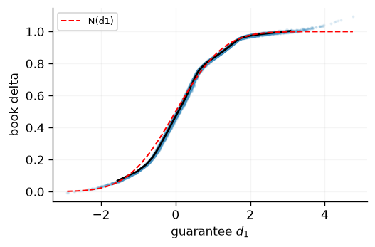
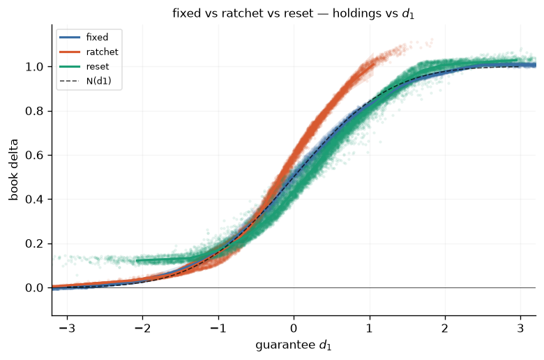
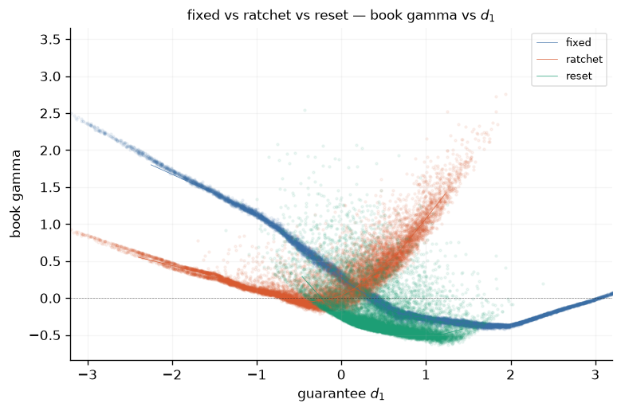
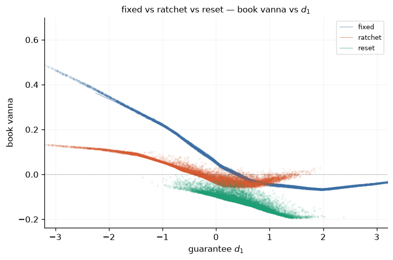
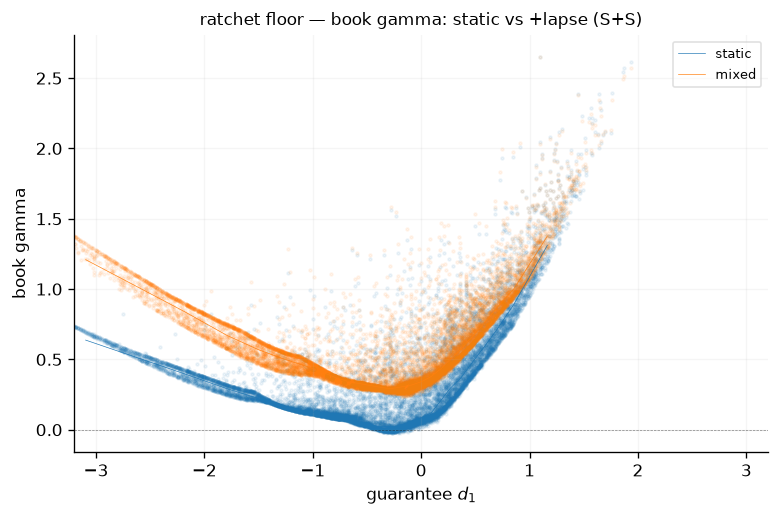
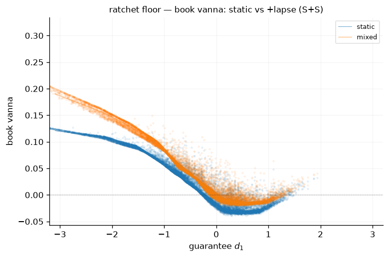
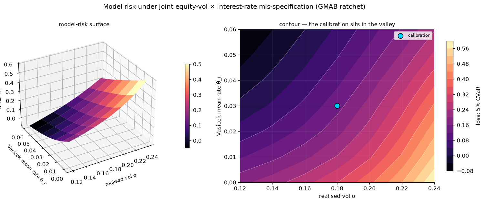
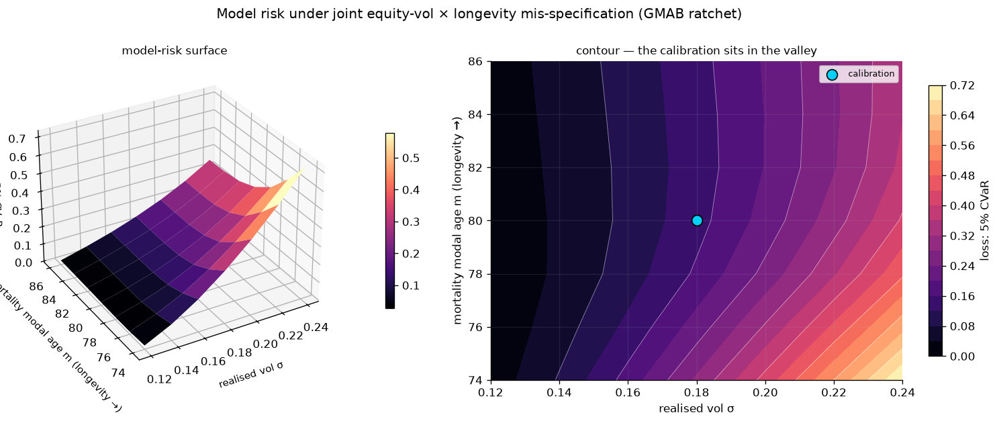
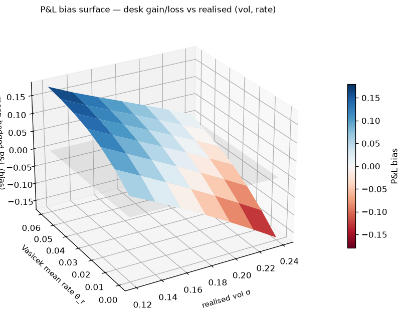
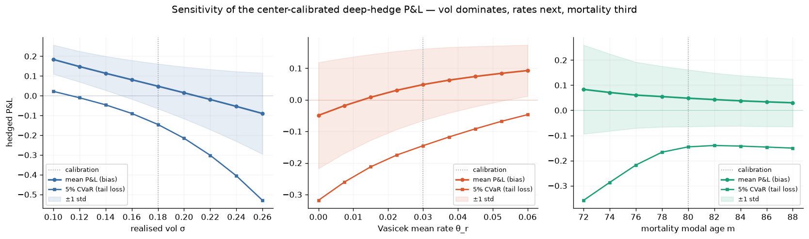

# GMxB Model Risk & the Greeks of the Hedge

### What a calibrated deep hedge gets wrong when the world moves — and the short-gamma book underneath it

---

Parts 1 and 2 built the liability and the hedge. This note does two things with them. First
it shows the deep hedge produces **correct, interpretable holdings across the whole
GM(A/W/D)B family** — every product, every floor, with and without lapse, with mortality.
Then it turns that machinery into a **model-risk instrument**: train one hedge on a
calibrated world, freeze it, and evaluate it under *shifted* worlds. The surfaces show how
the P&L degrades as the realised world drifts from calibration, and they deliver a clean
verdict on what actually threatens a variable-annuity desk.

> **The headline.** Equity volatility is the dominant model risk; rates are second;
> mortality a distant third. And underneath the P&L sits a Greek profile every VA desk
> recognises — **structurally short gamma**, with the floor type deciding whether that
> exposure bleeds off or compounds.

---

## 1 · The analytic anchor — book delta is $N(d_1)$

On the cleanest contract — a fixed floor $G=P$, static, no mortality, flat regime — the
state collapses to $(A,\tau)$ and the optimal **book delta is exactly $N(d_1)$**. The deep
hedge recovers it in tens of epochs (the leg split — how much delta the stock vs the puts
carry — owns $\sim10^{-3}$ of the loss and converges hundreds of epochs later).



*The trained book delta against the guarantee $d_1=\big(\log(A/G)+(r+\sigma^2/2)\tau\big)/(\sigma\sqrt\tau)$,
overlaid with $N(d_1)$. This is the anchor every other result is checked against.*

This anchor matters for everything below: it means the GMxB liability *is*, locally, a put
on the account struck at the floor, and its book Greeks are the Black–Scholes Greeks of
that put. The floor type does not change that — it changes **where on the $d_1$ axis the
contract lives over its life**.

---

## 2 · Regime sweep — where the spread comes from

Holding the rider economics fixed and piling on state variables (flat → Vasicek rate →
Heston vol → stochastic mortality), the holdings cloud **widens**. At a fixed spot the book
can sit anywhere in a band, because the policy is responding to coordinates the spot axis
does not show. The within-coordinate **spread is the object of interest**, not noise.

The $d_1$ *collapse* is the diagnostic. For a fixed floor, $G$ is constant, so $d_1$ is a
monotone reparametrisation of spot — re-plotting reveals nothing. The collapse is genuine
only when the floor moves with the path: on **reset** and **ratchet+lapse** worlds the
$A/G$ dispersion is absorbed by the guarantee and the holdings tighten onto a function of
$d_1$. The residual width that survives is exactly the spread injected by rate / vol /
mortality.



*Book delta vs $d_1$ for three floors, all against the $N(d_1)$ reference. The **fixed**
floor sits on $N(d_1)$ and runs deep in-the-money; the **ratchet** high-water mark pins
$A/G\le1$ so $d_1$ is capped near zero — the book stays near full delta and rides
**above** $N(d_1)$ in the mid-region; **reset** sits between. That elevation above
$N(d_1)$ is the impending-ratchet term, and it is the first sign of the gamma story.*

---

## 3 · The short-gamma problem, made precise

Every VA desk knows it is short gamma. The framework lets us say exactly *why*, *where*,
and *how much*, and lets us compare floors and lapse settings directly. The starting point
is the observation that a ratchet/reset guarantee is a `max` over the account sampled at
**discrete anniversary dates** — structurally a discretely-monitored lookback — so the
desk's delta is discontinuous across each monitoring date:

> Before an anniversary the lock-in is pending, so a move in spot moves the guarantee that
> is about to be locked: the delta carries an impending-ratchet term $\partial(\text{future
> }G)/\partial S\neq0$. After the anniversary the guarantee is a fixed amount; today's spot
> no longer moves an already-locked level, so that term is zero. The value is continuous
> across the anniversary; its delta is not. **The sawtooth is the signature of short gamma
> concentrated at the monitoring date** — running into the anniversary the desk buys on the
> way up and sells on the way down around the at-the-money reference, then rebalances at the
> lock. The gamma "bleed" around anniversaries is a property of the contract, not of the
> model.

<p align="center">
  
  
</p>

### 3.1 Lapse reshapes the Greeks at the surrender boundary

<p align="center">
  
  
</p>

---

## 4 · Model-risk surfaces

Now the model-risk move. Train one standard deep hedge on a **center calibration** (Heston
vol $\sigma=18\%$, Vasicek mean rate $3\%$, mortality modal age 80). Freeze the policy —
weights *and* its calibrated input standardiser — and evaluate it under **shifted** worlds
with no retraining. For each world record the hedged-book terminal wealth
$W=\text{center price}+(\text{hedge PnL}-\text{liability}-\text{costs})$; its mean is the
model-risk **bias**, its 5% CVaR the **tail loss**. A fixed seed across grid points makes
every surface a paired comparison.

```python
def diagnose_under(res, reg2, gm2, *, diag_paths=8000, seed=4242):
    """Evaluate an ALREADY-TRAINED policy under a DIFFERENT world (reg2, gm2).
    The MLP (incl. its calibrated standardiser) trained on res.reg; the paths
    come from reg2 with shifted parameters. Transfer weights — no retraining."""
    legs, _ = make_legs(reg2.stock, tenor=res.tenor)
    feats = gmab_features(reg2, len(legs))
    hed2 = DeepHedger(
        HedgingMLP(feats.total_dim, n_hedges=len(legs)),
        feats,
        legs,
        VarianceLoss(),
        liability=lambda t, m: t.price(m)[0],
        liveness=MortalityLiveness() if reg2.hazard else None,
    )
    hed2.model.load_state_dict(res.hedger.model.state_dict())  # freeze the rule
    d = hed2.diagnose(
        gm2,
        system=reg2.system,
        calendar=res.cal,
        rebalance_dates=res.rebal,
        market=reg2.market,
        n_paths=diag_paths,
        seed=seed,
    )
    return d

```

The two surfaces sweep equity-vol against rate and against longevity:



*Loss (5% CVaR) over realised vol $\sigma$ and Vasicek mean rate $\theta_r$ for a GMAB
ratchet. The calibration sits in the valley; contours fan diagonally — **both axes matter,
but the vol axis is steeper**.*



*The same construction against mortality modal age. The contours are nearly **vertical** —
visual proof that mortality mis-specification is second-order to equity vol: you can move
the longevity assumption a long way and the hedged loss barely changes.*

The **signed** bias is a tilted plane: the desk profits when realised vol comes in below
calibration and loses when it overshoots — the direct P&L expression of the short-vega,
short-gamma book mapped out in §3.



*Mean hedged P&L over (vol, rate). The plane tilts down in vol: realised vol above
calibration is a loss. This is the §3.3 vega exposure turned into money.*

---

## 5 · The ranking — one tornado

Cutting each axis through the calibration quantifies the asymmetry directly:



*Hedged P&L (bias, mean) and tail loss (5% CVaR) along each axis, with the $\pm1$ std band.

---

